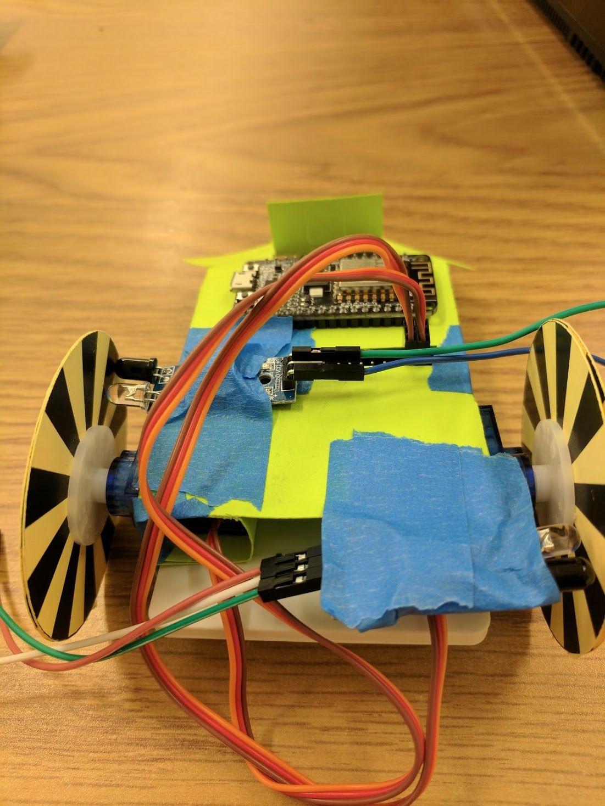

# Lab 4: State Estimator  
### Team Member: Zhuoran Duan, Zixuan Fan, Likai Wei  

Lab4 is a state estimator implemented on a two wheeled robot to determine the current states of the robot. The state estimator of the lab is based on Extended Kalman Filter.    

  - **Bill of materials**  
  - **Hardware Design**  
  - **Modeling of robot movement**  
  - **Extended Kalman Filter**  
  - **Reference**  
  - **License**  

### Bill of materials
To use this API, the following hardware requirements have to be met:
* [ESP8266 micro-controller](https://en.wikipedia.org/wiki/ESP8266) - ESP8266 Micro-controller with Internet shield
* [ESP-12E motor shield](https://smartarduino.gitbooks.io/user-mannual-for-esp-12e-motor-shield/content/interface.html) - Motor shield for ESP8266 to drive the servos
* [Continuous servo x2](http://www.robotshop.com/en/9g-continuous-rotation-micro-servo.html?gclid=CjwKEAiAuc_FBRD7_JCM3NSY92wSJABbVoxBr_84gd3C95CZ1ej68wuzu-aVRZ8oqgd1agMPi5WTQxoCDYPw_wcB)
* [MPU 5060 Gyroscope sensor](http://playground.arduino.cc/Main/MPU-6050)
* [FC-51 Infrared sensor x2](http://www.playembedded.org/blog/en/2016/01/08/detecting-obstacle-with-ir-sensor-and-arduino/)
* Portable battery
* [Paper Robot](https://git.uclalemur.com/mehtank/paperbot)
* Mini USB cable

### Hardware Design
#### Main robot body
The two wheeled is based on the [paperbot project](https://git.uclalemur.com/mehtank/paperbot) The robot body is constructed by folding and cutting a printable paper chassis. Two continuous servos are connected to the MCU to maneuver the movement of the robot. By changing the rotation speeds of different servos, we can achieve movements in four directions, including: forward, backward, left and right. Controlling of the robot is implemented by a web server user interface allowing user to adjust the direction and speed of the movement. The whole system is powered by a portable battery placed inside the chassis through a micro-usb port.

#### Picture of assembled robot


#### Sensors
The FC-51 infrared sensor is used to determine the rotation speed of each wheels. Paper wheels has dark and bright color stripes on top of it. Infrared signal will be absorbed after hitting a dark surface. In contrast, bright color surface will reflect all infrared lights. The sensor is consisted of one infrared emitter, one infrared sensor and three pins for power and outputs. The emitter emits infrared light and the receiver can determine whether there are reflected lights to determine the existence of an obstacle. Three pins on the sensor represent Vcc, GND and outputs. Vcc and GND are used for powering the sensor itself, and the results of detection are transmitted to the MCU using the output pin. While the wheels are spinning, the receiver will see consecutively changing bright and dark colors, therefore we can calculate the speed of rotation by counting numbers of changes of dark and bright.

#### Sample code for obstacle detection
```
#define IR 2  
int detection = HIGH;    // no obstacle
void setup() {
  Serial.begin(9600);  
  pinMode(IR, INPUT);
}
void loop() {  
  detection = digitalRead(IR);
  if(detection == LOW){
    Serial.print("There is an obstacle!\n");
  }
  else{
    Serial.print("No obstacle!\n");
  }
  delay(500);    // in ms
}
```
#### MPU-6050 Gyroscope
MPU-6050 sensors contains an accelerometer and a gyro on a single chip. The gyroscope uses I2C communication protocol to talk between sensor and MCU. We can read raw values of all the parameters including acceleration and angular velocity in x, y and z directions. Since the chip only outputs raw values, scaling must be done in order to use the data.

#### Sample code for getting raw values
```
#include <Wire.h>
#define MPUAddr 0x68

int16_t ax,ay,az,gx,gy,gz;

void setSleep(bool enable)
{ 
  Wire.beginTransmission(MPUAddr);
  Serial.println("began trans");
  Wire.write(0x6B);
  Wire.endTransmission(false);
  Wire.requestFrom(MPUAddr, 1, true);
  uint8_t power= Wire.read();
  Serial.println("changing sleep bit");
  power = (enable) ? (power | 0b01000000) : (power & 0b10111111);
  Serial.println("setting sleep bit");
  Wire.beginTransmission(MPUAddr);
  Wire.write(0x6B);
  Wire.write(power);
  Wire.endTransmission(true);
}

void getAccelData(int16_t* ax, int16_t* ay, int16_t* az)
{
  Wire.beginTransmission(MPUAddr);
  Wire.write(0x3B);
  Wire.endTransmission(false);
  Wire.requestFrom(MPUAddr, 6, true);
  *ax = Wire.read() << 8 | Wire.read();
  *ay = Wire.read() << 8 | Wire.read();
  *az = Wire.read() << 8 | Wire.read();
}

void getGyroData(int16_t* gx, int16_t* gy, int16_t* gz)
{
  Wire.beginTransmission(MPUAddr);
  Wire.write(0x43);
  Wire.endTransmission(false);
  Wire.requestFrom(MPUAddr, 6, true);
  *gx = Wire.read() << 8 | Wire.read();
  *gy = Wire.read() << 8 | Wire.read();
  *gz = Wire.read() << 8 | Wire.read();
}

void setGyroPres(uint8_t val)
{
  val &= 0b11;
  val = val << 3;
  Wire.beginTransmission(MPUAddr);
  Wire.write(0x1B);
  Wire.write(val);
  Wire.endTransmission(true);
}


void setAccelPres(uint8_t val)
{
  val &= 0b11;
  val = val << 3;
  Wire.beginTransmission(MPUAddr);
  Wire.write(0x1C);
  Wire.write(val);
  Wire.endTransmission(true);
}


void setup() {
    Wire.begin(12,13);
    Serial.begin(9600);
    Serial.println("initalizing");
    Serial.println("setting sleep");
    setSleep(false);   
    Serial.println("done initalizing");
    setGyroPres(0);
}

void loop() {
//      Serial.println("in loop");
        getAccelData(&ax, &ay, &az);
        getGyroData(&gx, &gy, &gz);
//      Serial.print("Ax: ");
//      Serial.println(ax);
//      Serial.print("Ay: ");
//      Serial.println(ay);
//      Serial.print("Az: ");
//      Serial.println(az);
//      
//      Serial.print("Gx: ");
//      Serial.println(gx);
//      Serial.print("Gy: ");
//      Serial.println(gy);
        Serial.print("Gz: ");
        Serial.println(gz);      
        delay(500);
  }
```

#### Modeling of robot movement
The movement of the robot can be modeled as a system with two controllable variables: velocities of left and right wheels.


This figure(credited to https://www.researchgate.net/publication/232322023_Wireless_underwater_mobile_robot_system_based_on_ZigBee) represents our model for the system. By applying geometric rules, we can find the relationship between states of robot and velocities of the left and right wheels.


Above equations represent the relationship of wheel velocities and total velocities(left equation) and relationship of robot states based on total velocities(right equation). Putting them together, we can generate the relationship of robotics states based on wheel velocities.


Since we know PWM signals and wheel velocities follows a linear relation, we can represents robot states using our PWM signal inputs.


According to Kalman Filter, the final expression will look like


With Matrices **A** and **B** equal to:


The vector on the left side of the equation represents six predicted states of our system:x position, y position, angle, x velocity, y velocity and angular velocity. Therefore, we can use the equation between previous states and next states to predict the state variables of the Kalman Filter.

### Extended Kalman Filter
For the purpose of this project, we implemented an Extended Kalman Filter to estimate the state of the Plant. The Extended Kalman Filter

The Extended Kalman Filter we implemented uses six state variables for the robot in 2-DOF space: its location x, y and angle θ relative to the reference frame and velocities x’, y’, and θ’ representing the angular velocity of the robot.

Two inputs are taken into the Plant of the system. PWM voltage of the servo on the left wheel , pwm1 and PWM voltage of the servo on the right wheel, pwm2. In order to estimate the states, we utilized three sensor measurement to implement the sensor fusion. Two FC-51 Infrared sensors used to measure the angular velocities of the two wheels and a MPU-6050 gyroscope for measuring the angle of the robot related to the absolute reference frame. The resulting state space description of the system is expressed as the follows:


where xk is the 6-variable state vector and A is the homogeneous state transition matrix of the previous state. B is the state transition matrix of the input vector uk, which is a 2x1 matrix. Matrix C is the matrix of the observation regarding the current state. vk is the measurement processing noises.

Pk is the predicted covariance estimate, and it’s a result of the state transition matrix A and the previous covariance estimate of the system.

And finally Gk is the optimal Kalman gain, used to update the current state estimate xk


### Reference  
 * [FC-51 Example](http://www.playembedded.org/blog/en/2016/01/08/detecting-obstacle-with-ir-sensor-and-arduino)  
 * [MPU5060 Tutorial](http://playground.arduino.cc/Main/MPU-6050)  
 * [Wireless underwater mobile robot system based on ZigBee](https://www.researchgate.net/publication/232322023_Wireless_underwater_mobile_robot_system_based_on_ZigBee)
 * [Extended Kalman Filter](https://en.wikipedia.org/wiki/Extended_Kalman_filter)  
 * [Kalman Filter Interactive Tutorial](http://home.wlu.edu/%7Elevys/kalman_tutorial/)  
 * [TinyEKF API](https://github.com/simondlevy/TinyEKF)   
 * [ESP8266 motor shield diagram](http://amazingrobots.net/resources/motor_shield_diagram/)  
 * [ESP8266 board pin mappings](http://amazingrobots.net/resources/nodemcu_pinout/)  
 * [ESP8266-12E quick guide](http://ucla.mehtank.com/teaching/2016-17--02--ee183da/esp8266-12e-quick.pdf)  
 * [ESP8266 programming tutorial](http://www.instructables.com/id/Programming-the-ESP8266-12E-using-Arduino-software/)  

### License  
**MIT**

[//]: # (These are reference links used in the body of this note and get stripped out when the markdown processor does its job. There is no need to format nicely because it shouldn't be seen. Thanks SO - http://stackoverflow.com/questions/4823468/store-comments-in-markdown-syntax)


   [dill]: <https://github.com/joemccann/dillinger>
   [git-repo-url]: <https://github.com/joemccann/dillinger.git>
   [john gruber]: <http://daringfireball.net>
   [@thomasfuchs]: <http://twitter.com/thomasfuchs>
   [df1]: <http://daringfireball.net/projects/markdown/>
   [markdown-it]: <https://github.com/markdown-it/markdown-it>
   [Ace Editor]: <http://ace.ajax.org>
   [node.js]: <http://nodejs.org>
   [Twitter Bootstrap]: <http://twitter.github.com/bootstrap/>
   [keymaster.js]: <https://github.com/madrobby/keymaster>
   [jQuery]: <http://jquery.com>
   [@tjholowaychuk]: <http://twitter.com/tjholowaychuk>
   [express]: <http://expressjs.com>
   [AngularJS]: <http://angularjs.org>
   [Gulp]: <http://gulpjs.com>

   [PlDb]: <https://github.com/joemccann/dillinger/tree/master/plugins/dropbox/README.md>
   [PlGh]:  <https://github.com/joemccann/dillinger/tree/master/plugins/github/README.md>
   [PlGd]: <https://github.com/joemccann/dillinger/tree/master/plugins/googledrive/README.md>
   [PlOd]: <https://github.com/joemccann/dillinger/tree/master/plugins/onedrive/README.md>
